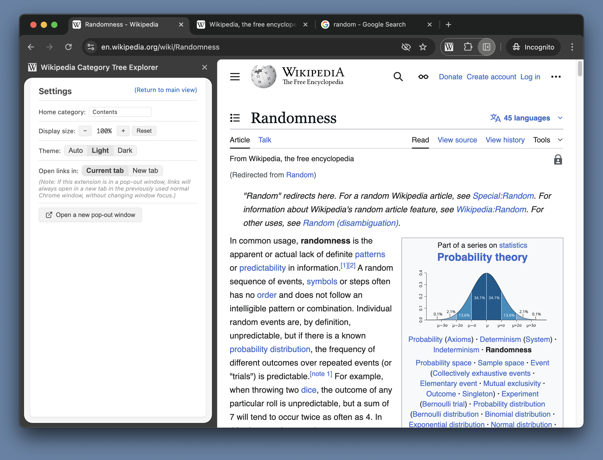

# Wikipedia Category Tree Explorer

A Chrome extension that lets you navigate [Wikipedia's category graph/"hierarchy"/"tree"](https://en.wikipedia.org/wiki/Help:Category) via the [English Wikipedia API](https://www.mediawiki.org/wiki/API:Action_API). 

 

Can optionally show the categories of the current page, if that page is a wikipedia page: 

Can view the inverted tree (makes it easier to traverse up the "tree", since it's not actually a strict hierarchy (categories can have multiple parents, and there are some cycles)): 

settings page:

dark mode, also chrome lets you click+drag to resize the side panel:

and if you want even more room you can pop-out the window.

## Installation

### From Chrome Web Store
Look for the "Wikipedia Category Tree Explorer" extension on the chrome web store (https://chrome.google.com/webstore). 
- todo: add link 

### Manual Installation 
1. Download or clone this repository
2. Open Chrome and navigate to `chrome://extensions/`
3. Enable "Developer mode" in the top right
4. Click "Load unpacked"
5. Select the extension directory