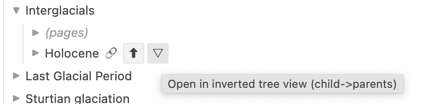
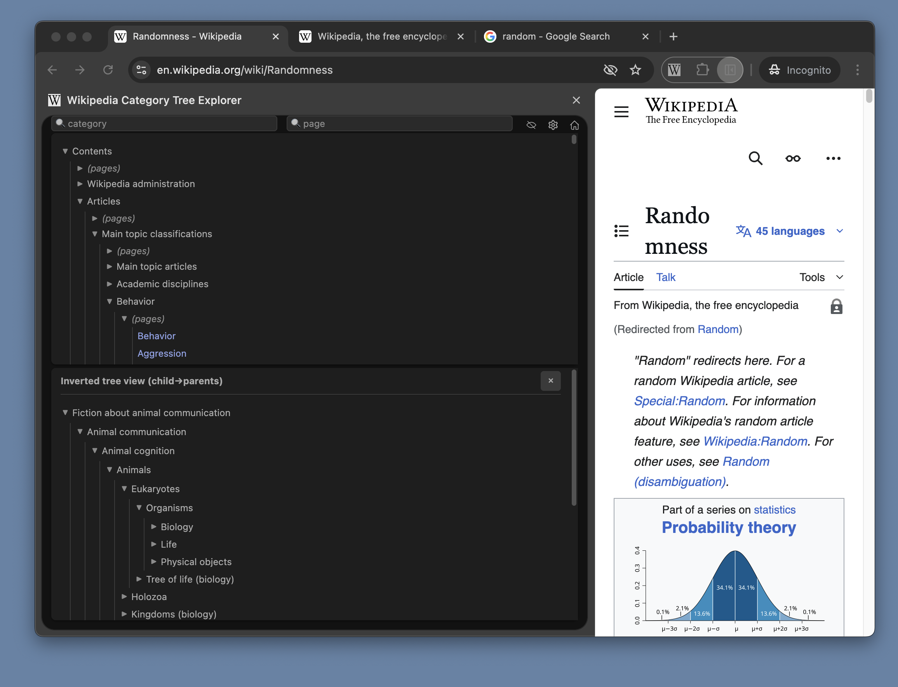
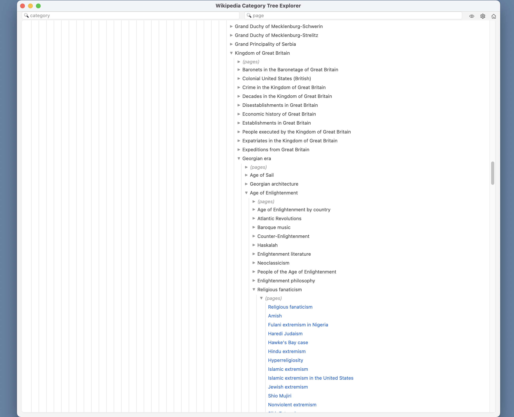
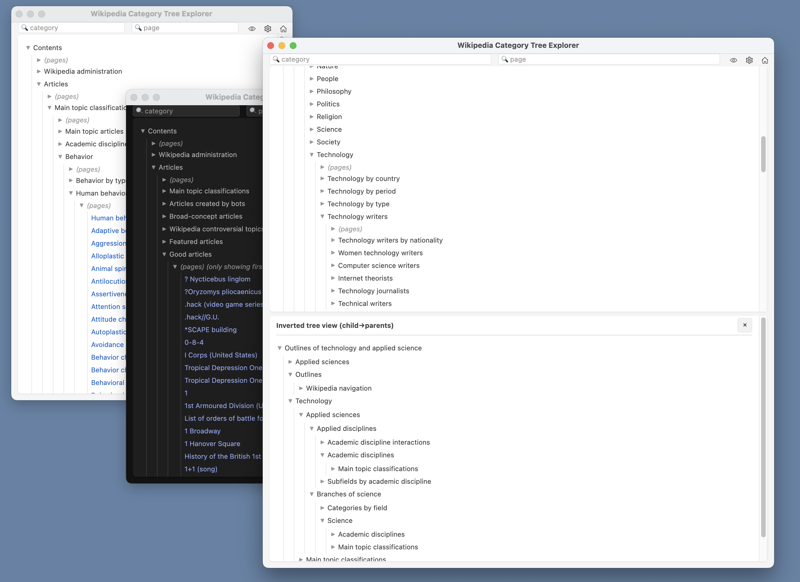

# Wikipedia Category Tree Explorer

A [Chrome extension](https://chromewebstore.google.com/detail/wikipedia-category-tree-e/eppjdfeepdjjcgbklfdlbafjlgbbpmij) that lets you navigate [Wikipedia's category graph/"hierarchy"/"tree"](https://en.wikipedia.org/wiki/Help:Category) via the [English Wikipedia API](https://www.mediawiki.org/wiki/API:Action_API). 

 

Can optionally show the categories of the current page, if that page is a wikipedia page, and if it has any non-hidden (non-maintenance) categories

 
 

Can view the inverted tree (makes it easier to traverse up the "tree", since it's not actually a strict hierarchy (categories can have multiple parents, and there are some cycles)): 

 

 

dark mode, also chrome lets you click+drag to resize the side panel:

 

for more room, you can pop-out the window:

  

and/or have multiple going at once: 

## Installation

### From Chrome Web Store
https://chromewebstore.google.com/detail/wikipedia-category-tree-e/eppjdfeepdjjcgbklfdlbafjlgbbpmij 

### Manual Installation 
1. Download or clone this repository
2. Open Chrome and navigate to `chrome://extensions/`
3. Enable "Developer mode" in the top right
4. Click "Load unpacked"
5. Select the extension directory

 

# Some metrics 
I explored, but abandoned, the possibility of optionally displaying the count of recursively-reachable subcategories and/or pages alongside each category. The motivation here was wanting to be able to see something like the "weight", or "abstraction weight", of every category. 

 

Imagine you saw that a child category had 1000 recursively-reachable subcategories or pages within it, while all the other children only had a few dozen. If this was surprising to you, given the semantics of what those children were "about", then this might serve as an indication to you that your map of the territory was missing something important; it might mean there are multiple layers of meaningful distinctions/abstractions that are unknown to you, hidden within the layers, and thus producing what appears to you as an outsized/surprising count/weight. 

 

This was the idea, but in practice I think it's unworkable, at least in this simple form. 

 

This is mostly because the graph contains weird jumps in ontology known as [category escape hatches](https://en.wikipedia.org/wiki/Wikipedia:Category_escape_hatches). For example, there exists (as of writing this) a subcategory path (parent -> child categories; not just any hyperlinks) from "Mathematics" to "Genocide": 

 

mathematics  
fields of mathematics  
applied mathematics  
applied probability  
statistical mechanics  
gases  
atmosphere   
climate  
climate history   
history of climate variability and change   
ice ages  
interglacials  
holocene  
1st millennium   
middle ages   
medieval society   
medieval economic history   
feudalism   
estates   
nobility   
nobility by continent  
royalty by continent  
monarchs by continent  
monarchs in europe  
former monarchies of europe  
kingdom of great britain  
georgian era  
age of enlightenment  
religious fanaticism  
religious fundamentalism  
religiously motivated violence  
religious persecution  
genocide  

 

Thus any simple counting metric like I had in mind is going to have the "weight" of the Genocide category contributing to the "weight" of Mathematics, so isn't meaningful. 

 

To fix this, one could either endeavor to remove all category escape hatches (or just more generally seek to improve the category nesting/graph itself), or come up with a more complicated metric. 

 

If we're improving the category graph, fine, but at that point we might as well be making edits to wikipedia directly. If instead I was to remove them from just my local copy of the graph, then it feels like I'm losing touch with the actual "territory" of wikipedia itself, and also entering more into the equillibrium of just....normal personal note taking.

 

Re: making a more complicated metric, this doesn't seem worth it. A large part of the appeal here was the simplicity of a category being able to say of itself: "this is how much I contain". Getting more complicated than this thus also feels like losing touch with the territory. 

 

And even if one had overriding dictatorial editing powers, removing escape hatches in full generality might not be straightforward. Their existence might be a pretty natural consequence/side-effect of the [folksonomic](https://en.wikipedia.org/wiki/Folksonomy)/crowdsourced nature of wikipedia itself.  

 

Finally, these metrics have to be precomputed from [static data dumps](https://meta.wikimedia.org/wiki/Data_dumps), so in many places the metric becomes stale and/or confusing almost immediately (ex: "why is the count so high for this category that actually has no children?" --> A: the category membership got edited; the child that contributed that count has since been removed from the parent category in the live version of wikipedia). 

 

But if curious, you can view these metrics at https://github.com/Caseythezahima/wikipedia-category-tree-explorer/tree/main/metrics, which iirc were calculated using the Sep 21st release of the data dumps. There's also scc_list.json, which documents all the [strongly connected components (SCCs)](https://en.wikipedia.org/wiki/Strongly_connected_component) of size >= 2 that existed in that dataset. This is perhaps another way of looking at the same problem (all the members of a given SCC are going to have the same count-metrics, but you can see just how different/unrelated some of the member categories are from each other.)

 

If you wish to get your own copy of the category graph from the wikipedia data dumps, here is the chain of urls you'll be interested in:  
- https://meta.wikimedia.org/wiki/Data_dumps  
- https://dumps.wikimedia.org/  
- https://dumps.wikimedia.org/backup-index.html  
- click the enwiki link (for "english wikipedia") -> which redirects to the latest dump, which in this case is this url: https://dumps.wikimedia.org/enwiki/20251020/ 

 

and these are the files/tables you need: 
- page.sql.gz  (https://www.mediawiki.org/wiki/Manual:Page_table)  
- categorylinks.sql.gz  (https://www.mediawiki.org/wiki/Manual:Categorylinks_table)  
- linktarget.sql.gz  (https://www.mediawiki.org/wiki/Manual:Linktarget_table)

 

Also take note of the way category links work. If you are sanity checking against live wikipedia and/or the edit history, you must check the edit history for the *children*, not the parents. It is by placing a link on a child page that a link is created to the parent, not the other way around. So if you look at the edit history of the parent, you won't see the history of all the children being added/removed from it, because that is not where such information exists. 
